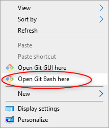
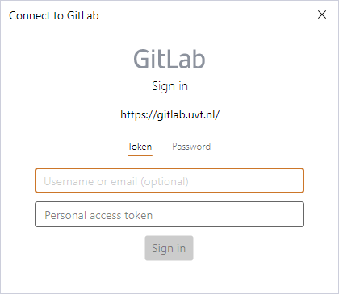
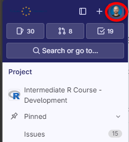
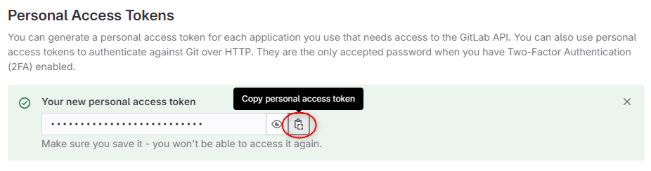
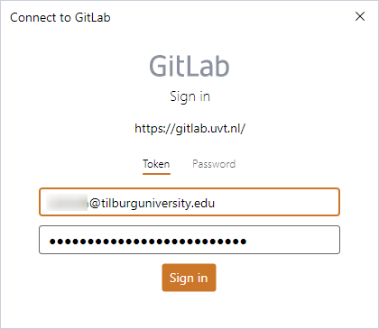

# Setup for Intermediate-level R course for Social Sciences 2024

We are happy to see you are interested in the *Intermediate-level R course for Social Sciences*! **R** is a powerful programming language and research tool that can do a variety of things for you. From cleaning and pre-processing your data, statistical analysis to advanced plotting and advanced documentation for your next reproducible research project, everything is just a few lines of code away! 🤓

Our course will be very interactive and you will get to write your own code right away! In order to get the smoothest experience we ask you to follow a couple of steps on the computer that you want to use during the training. This way, we can avoid any delays and dive right in!

## 1. Install R and Rstudio

> If you already have R and Rstudio installed, you can skip this step.

1.  Download **R** and **RStudio** on your computer by following the steps shown [here](https://posit.co/download/rstudio-desktop/)

    a.  First Install [**R** from CRAN](https://cran.r-project.org/). Make sure to choose the correct version for your operating system.

    b.  Then install [**RStudio** from posit.co](https://posit.co/download/rstudio-desktop/)

During the installation you can simply follow the instructions on screen and stick to the default settings.

2.  Open **Rstudio**. You might be prompted to specify the **R** version to use. Select the machine's default version or select the one you just installed.

3.  In the `Console` on the **bottom left** type `sessionInfo()` and press Enter. Make sure you have at least **R** version 4.4 installed.

    ```         
    sessionInfo()
    ```

4.  If you have an older version, download the most recent version [here](https://www.r-project.org/).

## 2. Install Quarto

> Quarto is frequently updated, so it's recommended to do this even if you have it already installed

Quarto is the a modern standard for interactive code notebooks that supports different languages and comes with other neat features. To use Quarto notebooks, you will need the **Quarto CLI**

1.  Download the **Quarto CLI** [here](https://quarto.org/docs/get-started/)
2.  Run the installation file and follow the instructions on screen. The default settings should be fine for our use case.

## 3. Install and configure Git (if you haven't already)

> If you already have Git installed, you can skip this step.

Please follow the instruction [here](https://coderefinery.github.io/installation/git-in-terminal/#installation).

## 4. Set up GitLab Access Token and Clone Repository

For more detailed information you can check [this tutorial](https://gitlab.uvt.nl/help/user/profile/personal_access_tokens.md).

1.  Navigate to [gitlab.uvt.nl](gitlab.uvt.nl) and log in with your Tilburg University credentials. Doing this for the first time will also create your GitLab account.

2.  On your computer, navigate to the folder where you want to place the files for the course.

3.  Right click and click on Open Git Bash here

    

4.  Type or copy-paste the following line of code into the terminal

    ``` bash
    git clone https://gitlab.uvt.nl/tsb-rst/intermediate-level-r-course-for-social-sciences.git
    ```

    If this is the first time you are interacting with GitLab, you should see the following **Connect to GitLab** window window. Leave this window open for now.

    

5.  Go back to GitLab. On the left sidebar, click on your avatar (either your profile picture on the first letter of your username)

    

6.  Select **Edit profile**.

7.  On the left sidebar, select **Access Tokens**.

8.  Select **Add new token**.

9.  If you do not enter an expiry date, the expiry date is automatically set to 365 days later than the current date. (recommended) To do so click on the grey X next to the expiration date.

10. Select the [desired scopes](https://gitlab.uvt.nl/help/user/profile/personal_access_tokens.md#personal-access-token-scopes). For this course you will only need `api`.

11. Select **Create personal access token**.

12. Copy the Access Token

    

13. Go back to the **Connect to GitLab** window.

    a.  Make sure **Token** is selected.

    b.  Enter your e-mail address in the top field.

    c.  Paste the Access Token in the bottom field.

    d.  Click **Sign In**.



> In case something went wrong and you lost your access token, you can simply create a new one as explained above.

14. Git will then get the files from GitLab and place them in the folder `intermediate-level-r-course-for-social-sciences`
